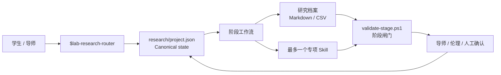

# 学位科研副驾驶

> 面向本科、硕士和博士项目的状态型科研工作台：从建档、选题、开题、研究设计到论文、答辩与归档。

[](https://github.com/momo-api/degree-research-copilot/actions/workflows/test.yml)
[](https://github.com/momo-api/degree-research-copilot/releases)
[](LICENSE)

`lab-research-kit` 是可安装的 Codex Plugin，内部提供 `$lab-research-router` Skill。它不是自动代写器，也不是把几十个第三方 Skills 全量塞进上下文；它负责维护项目状态、选择最小工作流、建立证据账本，并在阶段推进前执行结构闸门。

## 它解决什么问题

- 新项目初始化：记录学位、学校、预计毕业、题目、学科、课题类型和当前阶段。
- 跨会话恢复：以 `research/project.json` 为项目状态唯一源，不依赖聊天记忆猜测。
- 本硕博自适应：支持 Literature、Empirical、WetLab、Computational、Engineering、Design 和 General。
- 国内培养节点：任务书/培养计划、开题、中期/年度考核、预答辩、外审、提交、答辩和归档。
- 研究设计：实验单位、对照、重复、批次、随机化、多因素 DOE、样本量假设和统计分析计划。
- 论文治理：主张—证据映射、模拟评审、返修矩阵、答辩问题卡和 AI 使用记录。
- Profile 迁移：改学位、专业、Track 或阶段时补齐新文件、同步状态并保留历史文件。
- 阶段验证：检查实质内容和 CSV 数据行，空模板不能冒充完成。

它不能替代真实实验、导师、统计审查、伦理/安全审批或学校决定，也不保证毕业或投稿成功。

## 架构



核心 Skill 保持为轻量路由器；详细方法放在按需读取的 references 中；可重复且易出错的状态操作放在 PowerShell 脚本中。

## 在 Codex App 安装

要求：已安装 Codex CLI，且 Git 能访问本仓库。当前稳定版为 `v2.2.0`。

```powershell
codex plugin marketplace add momo-api/degree-research-copilot --ref v2.2.0
codex plugin add lab-research-kit@degree-research-copilot
```

安装后启动一个新的 Codex 任务，再输入：

```text
$lab-research-router
我是硕士一年级，专业是生物化学。请初始化我的研究项目，先完成 intake，
不要编造文献、数据、实验、审批或结果。
```

也可以在 Codex App 打开 **Plugins**，选择 **Degree Research Copilot** 来源，安装“学位科研副驾驶”，然后新建任务。

如果希望 Agent 代为完成安全检查和 CLI 安装，直接复制：

- [Codex App 一键安装提示词](prompts/CODEX-APP-INSTALL.md)

官方产品说明：Plugins 可在 Codex App 或 Codex CLI 中安装；安装后应开启新任务，让 bundled skill 被加载。参见 [OpenAI Plugins 文档](https://learn.chatgpt.com/docs/plugins)。

## 第一次使用

### 让 Agent 初始化

```text
$lab-research-router
请在当前课题目录建立研究档案。
学位：Master
学校：[学校]
预计毕业：[YYYY-MM]
题目：[暂定题目]
专业：[专业]
课题类型：WetLab
当前阶段：intake

先确认目录和关键输入，再运行初始化器；不要覆盖已有文件。
完成后返回当前状态、已创建档案、未解决风险和下一道导师确认点。
```

### 直接运行脚本

```powershell
$skill = "$HOME\.agents\skills\lab-research-router"

& "$skill\scripts\init-research-project.ps1" `
  -Path C:\research\my-thesis `
  -Title "课题名称" `
  -Degree Master `
  -Track WetLab `
  -Discipline "生物化学" `
  -CurrentStage intake `
  -Institution "学校名称" `
  -ExpectedGraduation "2027-06"
```

Plugin 安装后的实际缓存位置由 Codex 管理。日常使用优先让 `$lab-research-router` 调用配套脚本，不要假定缓存路径；上面的路径仅适用于独立 Skill 安装。

## 长期项目操作

```powershell
# 恢复当前状态
& .\scripts\research-status.ps1 -Path C:\research\my-thesis

# 安全修改课题类型和阶段
& .\scripts\update-research-project.ps1 -Path C:\research\my-thesis `
  -Track Computational -CurrentStage proposal -Health at-risk `
  -CurrentBlocker "数据授权未完成" -NextGate "确认数据集和基线"

# 阶段推进前验证
& .\scripts\validate-stage.ps1 -Path C:\research\my-thesis -Stage proposal
```

`research/project.json` 只负责项目身份和工作流元数据；原始数据、文献导出、仪器记录、代码版本、签字审批和人工决定仍是事实依据。

## 自适应模板规模

| Profile | 初始化文件数 | 特点 |
|---|---:|---|
| Bachelor + Literature | 19 | 不创建实验目录 |
| Bachelor + Engineering | 22 | 实现计划与需求—测试矩阵 |
| Bachelor + Design | 22 | 设计过程与评价计划 |
| Master + WetLab | 26 | DOE、随机化、SAP、分析与返修 |
| Doctoral + Computational | 28 | 研究计划、工作包与计算实验档案 |

文件数是自动化合同，不是“越多越专业”。项目只创建当前学位与 Track 所需的最小集合。

## 质量验证

```powershell
& .\scripts\test-repository.ps1
```

当前 2.2 测试结果：

- 源码目录：25/25
- Release ZIP 解压副本：25/25
- 6 个 PowerShell 脚本语法通过
- Skill validator 通过
- Plugin validator 通过

测试覆盖 canonical state、冲突重新初始化、Profile 迁移、状态恢复、阶段闸门、历史文件保留、路径/元数据安全和不同学位/Track 的模板合同。测试验证软件行为，不验证任意科研结论必然正确。

完整报告见 [2.2 质量测试报告](docs/quality-report-2.2.zh-CN.md)。

## 仓库结构

```text
.
├── .agents/plugins/marketplace.json
├── .github/workflows/test.yml
├── plugins/lab-research-kit/
│   ├── .codex-plugin/plugin.json
│   └── skills/lab-research-router/
├── prompts/CODEX-APP-INSTALL.md
├── docs/
├── scripts/
├── CHANGELOG.md
└── README.md
```

## 第三方科研 Skills

本仓库不复制 ARS-Codex、Scientific Agent Skills、Nature Skills、ARIS、Orchestra、PaperSpine 等第三方代码。指南只记录经过核查的定位、许可证、安装入口和使用边界。安装任何第三方包前，应重新检查上游代码、权限、依赖和许可证。

详细选型与使用例子见 [中文完整指南](docs/guide.zh-CN.md)。

## 隐私与科研诚信

- 不要向仓库提交学生身份、未公开论文、患者信息、原始实验数据、凭据或真实 `research/project.json`。
- 不得编造论文、DOI/PMID、数据、样本量、p 值、实验、审批或工具结果。
- 计划、推断和真实完成的操作必须区分。
- 高风险实验仅能在批准 SOP、合格设施和监督框架内开展。
- 最终题目、确认性设计、提交和答辩结论必须由人负责。

安全问题请按 [SECURITY.md](SECURITY.md) 私下报告。

## 版本与贡献

- 变更记录：[CHANGELOG.md](CHANGELOG.md)
- 贡献说明：[CONTRIBUTING.md](CONTRIBUTING.md)
- 发布包：[GitHub Releases](https://github.com/momo-api/degree-research-copilot/releases)

## License

自建代码与文档采用 [MIT License](LICENSE)。引用或链接的第三方项目仍遵循各自许可证。
