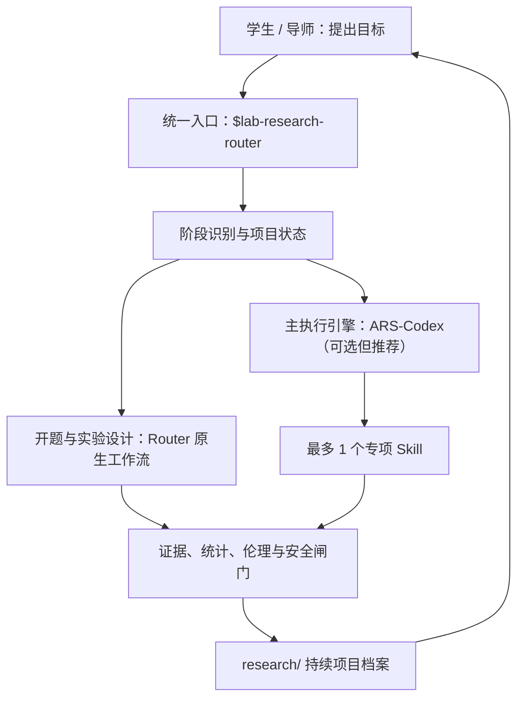
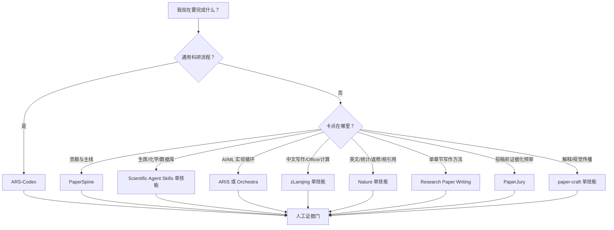

# 学位科研副驾驶 2.2

> 从建档、选题、开题、实验设计到论文、答辩与归档：一个入口、一个项目状态、逐关验证。

适用对象：本科生、硕士生、博士生、科研助理、导师与实验室管理员  
适用工具：Codex 桌面端、CLI、IDE，以及兼容 Agent Skills 标准的 Agent  
核验日期：2026-07-29

---

## 它到底是什么

`lab-research-router` 是一个可安装的**学位科研总控 Skill**，产品名称是“学位科研副驾驶”。`lab-research-kit` 是承载它的 Plugin 安装包名称。

它不是替学生编论文的写作机器人，也不是把几十个第三方 Skill 打包在一起。它负责：

- 判断研究处于选题、开题、实验、分析、写作、评审还是答辩阶段；
- 把聊天变成持续更新的 Markdown/CSV 项目档案；
- 用 `research/project.json` 记录学位、课题类型、阶段、健康状态、阻塞和下一闸门，跨会话恢复；
- 为每个阶段设置输入、产物和过关条件；
- 在可用时把文献/论文任务交给 ARS-Codex，把专业数据库或计算交给一个专项 Skill；
- 阻止编造引用、数据、实验、审批、显著性和结果；
- 要求导师、伦理/安全机构和研究者对关键决策负责。

一句话定位：

> 像一位随时在线、会追问、懂研究设计、能持续跟进，但每条关键结论都要求证据的科研副导师。

### 为什么不是“大杂烩”

核心 Skill 只保存路由、阶段和证据规则，开题、实验、写作等专业细节放在独立 reference 中按需加载。一次任务只选择：

```text
1 个学位层级 + 1 个课题类型 + 1 个当前阶段 + 最多 1 个专项 Skill
```

例如本科文献型论文不会加载湿实验设计，也不会创建随机化或统计分析文件；工程毕设创建需求—测试矩阵，设计毕设创建设计过程与评价计划；只有实证、湿实验和计算型课题才增加实验/分析档案。

---

## 一站式架构



| 层 | 组件 | 职责 |
|---|---|---|
| 入口层 | `lab-research-router` | 理解目标、识别阶段、规定产物和下一道闸门 |
| 执行层 | `academic-research-suite` | 文献、研究问题、论文、审稿、返修、统计解释的主引擎 |
| 专项层 | 单个生化/数据库/计算/Office Skill | 只解决当前一个有边界的专业问题 |
| 治理层 | 引用、实验、统计、伦理与安全规则 | 阻止把计划当结果、技术重复当样本、未经核实当事实 |
| 状态层 | `research/project.json` | 学位、课题类型、阶段、健康、阻塞和下一闸门的唯一状态源 |
| 证据层 | `research/` Markdown/CSV | 保存选题、证据、设计、决策、周报、会议、论文和答辩材料 |

“一站式”指的是你通常只调用一个入口，并能从现有项目继续；不代表一个模型可以代替真实检索、实验、导师或审批。

---

## 本硕博全周期

| 学位模式 | 默认要求 |
|---|---|
| Bachelor | 一个有边界的问题或作品；强调规范、可完成、学生能解释；允许应用、比较、复现、实现、综合或设计贡献 |
| Master | 一个可辩护的贡献；强调稳健设计、证据链、可复现、统计与风险控制 |
| Doctoral | 相互衔接的研究计划/工作包；强调原创性、独立验证、跨研究整合和长期决策记录 |

| 阶段 | 它帮助完成 | 必须留下的核心产物 |
|---|---|---|
| 建档 | 学位、学校、预计毕业、研究约束、目标、材料、截止时间 | `project.json`、`research-brief.md` |
| 选题 | 候选 RQ、创新性检索、可行性、最小验证、主备选 | `topic-candidates.md`、`novelty-audit.md` |
| 开题 | 现状、空白、假设、目标、技术路线、风险、计划、答辩 | `proposal-outline.md`、`technical-route.md` |
| 实验设计 | 单位、对照、重复、多因素 DoE、样本量、随机化、SAP | `design-brief.md`、`statistical-analysis-plan.md` |
| 执行与分析 | 原始数据、批次、偏差、版本、代码、确认/探索分析 | `experiment-log.md`、`analysis-log.md` |
| 论文 | 主张—证据、主线、大纲、分章写作、引用和图表审计 | `claim-evidence-map.md`、`manuscript.md` |
| 评审返修 | 模拟审稿、问题严重度、修改责任、逐点回复 | `review-matrix.csv`、`rebuttal.md` |
| 答辩 | 限时叙事、结论式页面、问题卡、证据边界 | `defense-outline.md`、`questions.md` |

培养节点由 `milestones.csv` 管理，可覆盖任务书/培养计划、开题、中期或年度考核、预答辩、外审、论文提交、正式答辩和归档。学校真实规定始终优先。

### 生化、医学、材料等湿实验能做什么

它能设计研究和统计方案，包括：

- 实验单位、观察单位、生物学重复、技术重复、子样本和批次；
- 阴性、阳性、空白、载体、基线、程序和质量控制；
- 完全随机、随机区组、完整/部分析因、正交、筛选、响应面、重复测量和混合效应设计；
- 样本量/功效所需假设、敏感性分析、随机化、盲法、运行顺序；
- 主终点、缺失/异常/排除规则、多重比较、交互效应和统计分析计划；
- 预实验、正式实验、确认实验、停止/转向判据、风险和备选路线。

它不能远程做湿实验，也不应绕过实验室 SOP、导师、伦理、生物安全、动物、化学品、临床或设施审批。涉及高风险操作时，只能在已批准 SOP 和合格监督框架内协助整理与核查。

---

## 三分钟开始一个项目

安装后在你的课题目录调用：

```text
$lab-research-router
我是[专业]的[本科/硕士/博士][年级]，当前方向是[方向]，
学校要求在[日期]前完成[开题/论文/答辩]。
已有材料在[路径]，可用资源是[样本/设备/预算/算力/时间]。
请判断当前阶段，建立或恢复 research/ 项目档案，
只处理当前最关键的一个决策，并告诉我产物、证据状态和下一道导师确认点。
不要编造文献、数据、实验、审批或结果。
```

若要让 Agent 初始化标准档案，可以说：

```text
$lab-research-router
请在当前课题目录运行配套的 init-research-project.ps1。
项目名称是“[名称]”，学位是 Bachelor/Master/Doctoral，
课题类型是 Literature/Empirical/WetLab/Computational/Engineering/Design，专业是“[专业]”。
只创建缺失文件，不覆盖任何已有文件；完成后告诉我从哪个阶段开始。
```

### 开题任务卡

```text
$lab-research-router
学校模板在 ./templates/开题报告.docx，文献和预实验在 ./literature/ 与 ./pilot/。
先建立“研究问题 → 目标 → 方法 → 终点 → 分析 → 判据”映射，
核查研究空白和创新点证据，生成技术路线、风险、备选方案和里程碑。
先给开题大纲和待核实清单，等我和导师确认后再写正式报告；
最后生成 12 分钟答辩结构和高频问题卡。
```

### 生化多因素实验任务卡

```text
$lab-research-router
研究目标：[目标]；候选因素与水平：[列出]；主要终点：[列出]；
资源限制：[样本/预算/周期/设备]。
请明确实验单位、对照、重复、批次和混杂因素；
比较完整析因、筛选、正交和响应面，说明运行数、可估计效应、交互/混杂和不能回答的问题；
给出预实验、正式实验、确认实验、样本量假设、随机化、QC、统计分析计划和转向判据。
操作细节以实验室批准 SOP 为准，不把计划写成结果。
```

更多选题、论文、审稿、返修和答辩示例已经包含在 Skill 的 `references/examples.md` 中，Agent 会按需读取。

### 2.2 的长期状态闭环

首次初始化：

```powershell
& .\scripts\init-research-project.ps1 -Path C:\research\my-thesis `
  -Title "课题名称" -Degree Master -Track WetLab -Discipline "生物化学" `
  -CurrentStage intake -Institution "学校名称" -ExpectedGraduation "2027-06"
```

以后每次恢复，不再让 Agent 靠聊天记忆猜：

```powershell
& .\scripts\research-status.ps1 -Path C:\research\my-thesis
```

改学位、专业、课题类型或阶段时，不要手改多个 Markdown 头部：

```powershell
& .\scripts\update-research-project.ps1 -Path C:\research\my-thesis `
  -Track Computational -CurrentStage proposal -Health at-risk `
  -CurrentBlocker "数据授权未完成" -NextGate "确认数据集和基线"
```

进入下一阶段前做结构闸门验证：

```powershell
& .\scripts\validate-stage.ps1 -Path C:\research\my-thesis -Stage proposal
```

验证器会检查是否有实质内容或 CSV 数据行，不把“空模板存在”当成完成。它只能证明项目合同满足，不能证明科研内容正确；后者仍需导师、领域专家、统计审查和真实证据。

课题类型迁移时，新类型需要的文件会补齐，旧类型文件保留为历史，不会静默删除。所有变更会进入 `decision-log.md`，状态页可重新生成。

---

## 推荐组合

推荐栈不是“装满热门 Skills”，而是：

```text
学位科研副驾驶（学位/课题自适应、阶段、档案与证据规则）
        ↓
1 个通用科研编排器（通常是 ARS-Codex）
        ↓
最多 1 个当前任务需要的专业技能
        ↓
人工核实引用、数据、实验与最终结论
```

默认选择：

| 你的任务 | 首选 |
|---|---|
| 本硕博建档、进度恢复、阶段判断 | 学位科研副驾驶：`lab-research-router` |
| 开题报告、技术路线、开题答辩 | Router 原生开题工作流；文献部分可衔接 ARS-Codex |
| 生化/医学/材料等湿实验、多因素设计、样本量与 SAP | Router 原生实验设计工作流；专业数据库/协议问题最多加一个专项 Skill |
| 选题、综述、论文、审稿、返修 | ARS-Codex：`academic-research-suite` |
| 论文贡献不清、主线断裂 | PaperSpine：`paper-spine` |
| 生信、药化、医学数据库 | Scientific Agent Skills 中的单个技能 |
| AI/ML 真实实验迭代 | ARIS 或 Orchestra，二选一并按项目安装 |
| 中文论文、组会 Word/PPT、常用科研计算 | zLanqing 三件套中的一个 |
| 英文润色、统计、返修、参考文献核验、投稿图 | 一个 Nature Skill |
| ML 论文某一章节的结构与段落自查 | Research-Paper-Writing-Skills |
| 已有草稿的投稿前证据化预审 | PaperJury Codex |
| 论文解读文章、视觉 Deck、方法示意图 | paper-craft 中的一个 |

> 核心红线：AI 生成的“像真的一样”不等于证据。未经核实的引用不是正常现象，而是必须处理的错误状态。

---

## 这次核验修正了什么

原始手册的方向基本正确，但安装和风险表述需要更新。

| 原内容 | 核验后结论 |
|---|---|
| 在 `config.toml` 开启 `[features] skills = true` | 当前 Codex 官方手册没有这一要求，默认删除 |
| 技能可直接放成 `skills/SKILL.md` | 每个技能必须有自己的目录：`skills/<name>/SKILL.md` |
| 项目级目录使用 `.codex/skills` | 当前官方公开文档使用 `.agents/skills` |
| 用户目录 `.codex/skills` 与 `.agents/skills` 二选一 | 官方公开文档列出 `$HOME/.agents/skills`；内置 `$skill-installer` 在部分版本仍写入 `$CODEX_HOME/skills`。优先用官方目录或安装器，不要手工混装 |
| 安装后必须完全重启 | Codex 通常会自动发现变更；未出现时重启或新开会话。部分第三方路由器明确要求新会话 |
| “引用是假的是正常现象” | 错误且危险。正确做法是阻止进入定稿，标记 `unresolved` 并核验 |
| zLanqing README 的安装命令可直接复制 | 当前 README 含“你的用户名”占位符、旧目录和未经官方文档支持的参数，不能原样照抄 |
| Nature Skills 只适合润色和返修 | 仓库覆盖图、写作、审稿、检索、核引用、统计、数据、实验日志、专利等；数量和成熟度以当前上游列表为准 |
| paper-craft 不推动核心研究 | 这是偏主观的判断。更准确的定位是“可选的科研传播与视觉表达层” |

“少装”有产品层面的依据：Codex 官方说明，初始技能列表有上下文预算；技能过多时会压缩描述，甚至省略部分技能。因而实验室采用“1 个通用 + 1 个专业”是合理的管理策略，但不是 OpenAI 的强制规则。

---

## 交付包里有什么

本指南配套 `degree-research-copilot-2.2.0.zip`，其中没有复制任何第三方技能代码，只包含自建内容：

```text
lab-research-kit/
├── .codex-plugin/plugin.json
└── skills/lab-research-router/
    ├── SKILL.md
    ├── agents/openai.yaml
    ├── references/
    │   ├── catalog.md       # 已核验的选型、安装与许可证信息
    │   ├── examples.md      # 每个推荐入口的详细示例
    │   ├── integrity.md     # 引用、实验、统计、临床与 AI 声明红线
    │   ├── degree-profiles.md # 本科/硕士/博士与课题类型自适应
    │   ├── lifecycle.md     # 本硕博全周期、阶段闸门与项目档案
    │   ├── proposal.md      # 开题报告、技术路线与答辩
    │   ├── experimental-design.md # 湿实验、多因素 DoE 与统计规划
    │   └── writing-review.md      # 论文、审稿、返修与答辩
    ├── assets/
    │   └── AGENTS.md.template
    └── scripts/
        ├── doctor.ps1       # 只读诊断技能路径与重名
        ├── init-research-project.ps1 # 建立 canonical state 和自适应档案
        ├── update-research-project.ps1 # 原子迁移项目 Profile，不删历史
        ├── research-status.ps1 # 跨会话读取并生成状态页
        ├── validate-stage.ps1 # 检查阶段文件的实质内容/数据行
        ├── quality-cases.json        # 8 类真实任务契约
        └── test-quality.ps1          # 无第三方依赖的质量测试套件
```

它既是一个可安装 Skill，也是一个可继续发布为 Codex Plugin 的标准目录。

---

## 5 分钟安装学位科研副驾驶

### 方式 A：直接把压缩包交给 Agent

把这段话和 `degree-research-copilot-2.2.0.zip` 一起发给 Agent：

```text
请先只读检查这个压缩包，确认包含：
lab-research-kit/skills/lab-research-router/SKILL.md

然后把完整的 lab-research-router 目录安装到：
$HOME/.agents/skills/lab-research-router

要求：
1. 不覆盖已有同名目录；若已存在，先给我 diff。
2. 不安装压缩包里没有声明的依赖。
3. 不执行第三方脚本。
4. 完成后检查 SKILL.md 和 references 链接，并告诉我如何用
   $lab-research-router 做一次只读测试。
```

### 方式 B：Windows 手动安装

```powershell
Expand-Archive .\degree-research-copilot-2.2.0.zip -DestinationPath .\degree-research-copilot-unpacked
New-Item -ItemType Directory -Force "$HOME\.agents\skills" | Out-Null
Copy-Item -Recurse `
  ".\degree-research-copilot-unpacked\lab-research-kit\skills\lab-research-router" `
  "$HOME\.agents\skills\lab-research-router"
```

若目标已存在，先比较，不要直接覆盖。

验证：

```text
/skills
$lab-research-router 帮我判断当前课题应该用哪个科研工作流；不要安装任何东西。
```

如果列表没有更新，新开一个会话；仍没有时再重启 Codex。

### 运行质量测试

```powershell
& "$HOME\.agents\skills\lab-research-router\scripts\test-quality.ps1"
```

2.2 发布包已在源码目录和 ZIP 解压副本各运行一次：两次均为 **25/25 通过**；Skill 和 Plugin 结构验证器也均通过。详细结果见配套《学位科研副驾驶-2.2-质量测试报告.md》。

测试覆盖：

- Skill frontmatter、触发词和核心体积；
- 所有内部 reference 链接；
- Plugin 版本和 UI 元数据；
- 本科文献型创建 19 个核心状态/管理/研究文件且不创建实验目录；
- 硕士湿实验创建实验设计、随机化、统计与返修档案；
- 博士计算型创建研究计划和工作包；
- 工程/设计型不会误建湿实验统计文件；
- canonical state 建立、恢复、状态页生成与冲突重新初始化拒绝；
- Profile 迁移会补文件、同步头部、写决策日志并保留旧类型历史；
- 空阶段验证失败、完成的 intake 通过、根目录/多行元数据/空更新被拒绝；
- 重复初始化不覆盖、`-WhatIf` 不写入、非法 Profile 被拒绝；
- 8类选题/开题/实验/工程/设计/写作/诚信任务的参考契约覆盖。

这是一套确定性的结构、脚本和工作流契约测试；它不能证明任意模型在任意问题上都能产出正确科研结论。真实论文、实验和统计仍需要材料级核验与人工负责。

---

## 选择器：今天到底用哪个



使用规则：

1. 一次任务只设一个“主编排器”。
2. 专业技能只处理一个有边界的子问题。
3. 没装的技能就明确说没装，不要假装调用。
4. 安装、更新、执行第三方脚本、外发数据前都要确认。

---

## 已核验的技能清单

### 1. ARS-Codex：全员通用首选

仓库：<https://github.com/Imbad0202/academic-research-skills-codex>  
形态：一个 Codex 原生路由技能 `academic-research-suite`  
许可：CC BY-NC 4.0，商业或混合用途先审许可证

官方上游当前推荐使用 Codex Plugin：

```powershell
codex plugin marketplace add Imbad0202/academic-research-skills-codex --ref main
codex plugin add ars-codex@ars-codex
```

新开会话后用 `/skills` 验证。正常情况下只看到一个 ARS 路由入口，而不是多个分散的 `deep-research`、`academic-paper`、`reviewer` 技能。

使用示例：

```text
$academic-research-suite
【身份】硕士一年级
【任务】把“生成式 AI 用于程序修复”收紧成可做的研究问题
【限制】单卡 24 GB GPU，六个月
【输出】候选问题对比、最终研究问题、检索式、纳排标准、文献矩阵表头
当前没有真实检索结果，只给计划，不编造论文。
进入检索前暂停让我确认。
```

```text
$academic-research-suite
审阅 ./paper/main.tex。
输出 Summary / Strengths / Major Weaknesses / Minor Weaknesses / Questions / Reproducibility。
每条意见给出文件、章节或行号定位；不要推断不存在的实验。
```

### 2. Scientific Agent Skills：生信、药化、医学与科研数据库

仓库：<https://github.com/K-Dense-AI/scientific-agent-skills>  
当前 README：158 个技能，覆盖大量数据库与科学计算包  
许可：MIT

不要默认全装。先列出，再装一个：

```powershell
gh skill install K-Dense-AI/scientific-agent-skills
gh skill install K-Dense-AI/scientific-agent-skills database-lookup --agent codex
```

或：

```powershell
npx skills add K-Dense-AI/scientific-agent-skills
```

典型入口：

| 技能 | 示例 |
|---|---|
| `database-lookup` | 查询基因与疾病证据，记录数据库、查询、过滤、ID、时间和来源；不做患者诊疗 |
| `paper-lookup` | 生成可复现检索式，实际检索后按 DOI/PMID 去重；全文未读标记“仅题录/摘要” |
| `scanpy` | 只读检查 AnnData，先确认 QC 阈值，再分阶段保存结果与环境信息 |
| `rdkit` | 标准化结构、保留原 ID、输出拒绝原因；计算性质不得写成实验测量 |

示例：

```text
使用 database-lookup。
查询基因 [GENE] 与疾病 [DISEASE] 的证据，优先 ClinVar、NCBI Gene、UniProt、Open Targets。
记录每个数据库的查询、过滤条件、稳定标识符和检索时间。
按遗传证据、功能证据、临床证据、冲突汇总；不要编造 PMID，不给患者诊疗建议。
```

### 3. ARIS：AI/ML 长流程实验迭代

仓库：<https://github.com/wanshuiyin/Auto-claude-code-research-in-sleep>  
定位：文献、想法、实验、审查、论文和持久研究记忆  
许可：MIT

Windows 项目级 Codex 安装：

```powershell
git clone https://github.com/wanshuiyin/Auto-claude-code-research-in-sleep.git "$HOME\aris_repo"
Set-Location "$HOME\aris_repo"
.\tools\install_aris.ps1 C:\path\to\your-codex-project -Platform codex
```

它是大包，应优先项目级、选择性安装。无人值守实验前必须审查权限、模型提供方、外部审查器、Hooks、预算与停止条件。

实际入口示例：

```text
/idea-discovery "calibration drift in retrieval-augmented generation"
Constraints: one 24 GB GPU, public datasets, 8-week pilot.
Require: baseline map, falsifiable hypotheses, cheapest discriminating experiment,
stop criteria, and novelty-check plan. Pause before implementation.
```

```text
/experiment-bridge
Plan: ./plans/pilot.md
Before running: capture git revision, environment, dataset version, seed,
baseline command, metric code, and output directory.
Run the smallest smoke test first; do not launch a long job until it passes.
```

### 4. Orchestra AI Research Skills：AI 研究工程技能库

仓库：<https://github.com/Orchestra-Research/AI-Research-SKILLs>  
当前 README：98 个技能、23 个类别，含 `autoresearch`  
许可：MIT

```powershell
npx @orchestra-research/ai-research-skills
```

用交互安装器选择 quickstart、类别或单技能。建议从 `autoresearch` 加一个真实使用的工程技能开始，例如 PEFT、vLLM、lm-eval-harness；不要默认装 98 个。

```text
Use the PEFT skill.
Design a QLoRA baseline for [MODEL] on [DATASET] with one 24 GB GPU.
Return a version-pinned environment, memory estimate, data checks, training config,
evaluation plan, and OOM fallback ladder. Do not start training until review passes.
```

ARIS 与 Orchestra 的选择：ARIS 更像长流程研究循环；Orchestra 更像覆盖训练、评测、推理、RAG、MLOps 等框架的工程知识库。

### 5. zLanqing：中文科研三件套

仓库：<https://github.com/zLanqing/codex-claude-academic-skills>  
许可：MIT；部分外部资源仍遵循原许可

当前 README 的安装章节含占位符和旧路径。请使用 `$skill-installer` 指向精确子目录：

```text
$skill-installer 请从以下地址安装：
https://github.com/zLanqing/codex-claude-academic-skills/tree/main/research-writing-skill
```

三个技能和示例：

```text
使用 research-writing-skill 修改 ./thesis/chapter3.md。
默认中文，保留公式、变量、方法名与引用键。
不得新增数据或 DOI；不确定内容标记“待核实”。
输出修订稿和逐项修改说明。
```

```text
使用 office-academic-skill，根据 ./notes/week12.md 和 ./figures/ 生成 10 页中文组会 PPTX。
每页使用结论式标题；图表保留坐标、单位、图例和来源。
生成后导出逐页预览，检查文字溢出、遮挡与缺图。
```

```text
使用 scientific-toolkit-skill 分析 ./data/sensor.csv。
先检查采样率、缺失、异常、单位与时间戳，再提出滤波和频谱方案。
确认后生成脚本、参数表、CSV 和 300 dpi 图；不要覆盖原始文件。
```

注意：`scientific-toolkit-skill` 当前明显偏光电信息、MATLAB/Python 科学计算，不应被描述为所有学科的通用计算包。

### 6. PaperSpine：论文主线与贡献

仓库：<https://github.com/WUBING2023/PaperSpine>  
当前 V4：一个 `paper-spine` 编排技能、12 个阶段  
许可：MIT

```powershell
git clone https://github.com/WUBING2023/PaperSpine.git
Set-Location .\PaperSpine
.\install.ps1 -CleanLegacy
```

从旧版升级时 `-CleanLegacy` 很重要。运行前查看脚本；它会为多个宿主安装并在用户目录记录状态。

```text
$paper-spine
目标：会议论文；草稿在 ./paper/，结果在 ./results/。
先和我确认一个主贡献、最多两个次贡献，以及每个贡献的直接证据。
未确认前不要写全文。确认后生成 motivation chain、claim-evidence map 和章节单元大纲。
```

### 7. Nature Skills：按任务选一个

仓库：<https://github.com/Yuan1z0825/nature-skills>  
当前：多技能仓库，清单与成熟度持续变化，安装前先运行 `--list`  
许可：Apache-2.0  
身份：社区项目，不是 Nature Portfolio 官方软件

```powershell
npx skills add Yuan1z0825/nature-skills --list
npx skills add Yuan1z0825/nature-skills --agent codex --skill nature-figure --yes --copy
```

部分技能依赖 `nature-shared`，以当前 README 为准。上游还给每个技能标注 Stable / Beta / Draft；Beta/Draft 不是不能用，而是输出要更严格复核。

每个技能的最短可用例子：

| 技能 | 示例任务 |
|---|---|
| `nature-figure` | 从真实 CSV 生成投稿图，导出脚本与 SVG/PDF/PNG，完整单位与误差定义 |
| `nature-polishing` | 润色摘要，数字、限制、引用键不变，并列出可能改变含义的句子 |
| `nature-writing` | 只用 evidence matrix 起草章节，缺证据处写 `[EVIDENCE NEEDED]` |
| `nature-reviewer` | 从方法、领域、统计三个视角预审，每条 major concern 带定位 |
| `nature-citation` | 为已标记主张检索限定来源，全文未核实不得声称“支持” |
| `nature-data` | 起草 Data Availability 和 FAIR 缺口；未知 accession 使用占位符 |
| `nature-statistics` | 审查实验单位、重复、样本量、多重比较、效应量与置信区间 |
| `nature-reader` | PDF 转中英对照 Markdown，保持章节、图表与来源锚点 |
| `nature-paper-card` | 精读单篇论文，建立实验—结论证据链与结论边界 |
| `nature-response` | 决定信与审稿意见转逐点矩阵，再写 response/cover letter |
| `nature-paper2ppt` | 论文转 12 页中文 journal club PPTX，优先复用原图并标来源 |
| `nature-paper-to-patent` | 区分公开内容、已有实验、建议实施例和待补数据后写技术交底 |
| `nature-ref-verifier` | 逐字段核对 BibTeX，输出 verified/conflict/unresolved |
| `nature-academic-search` | 多源检索、去重、引用核验，并记录指标检索时间 |
| `nature-downloader` | 只走开放获取与学校授权；遇登录、验证码、付费墙就停 |
| `nature-literature-pipeline` | 先 dry run 文献推送逻辑，未经确认不建定时任务、不发消息 |
| `nature-experiment-log` | 原始观察与推断分开，记录样品、设备、参数、偏差和文件哈希 |
| `nature-proposal-writer` | 先做 evidence ledger、论证图和章节契约，再进入正文 |

详细提示词已经放在插件的 `references/examples.md`。

### 8. paper-craft：科研传播与视觉表达

仓库：<https://github.com/zsyggg/paper-craft-skills>  
许可：MIT

```powershell
npx skills add zsyggg/paper-craft-skills
```

三个技能：

```text
使用 paper-comic 为 ./papers/target.pdf 提出 3 个方法图方案。
先列出来源元素与生成元素，确认后再生成；图中数字必须来自论文并给定位。
```

```text
使用 paper-deck 将 ./papers/target.pdf 制作 12 页 journal-minimal 学术汇报。
优先复用真实图表并标来源；输出 PPTX、PDF、逐页提示词和生成视觉清单。
```

```text
使用 paper-analyzer 分析 ./papers/target.pdf，风格 academic。
仅在核实为官方实现时对照 GitHub 代码；输出 HTML、公式解释、代码映射、限制和未解决问题。
```

它适合“讲清楚”，不负责证明研究结论正确。

### 9. Research-Paper-Writing-Skills：单章节写作方法

仓库：<https://github.com/Master-cai/Research-Paper-Writing-Skills>  
形态：一个 `research-paper-writing` Skill  
许可：MIT；主要写作方法来自仓库明确致谢的公开学习笔记

```text
$skill-installer Install research-paper-writing from:
https://github.com/Master-cai/Research-Paper-Writing-Skills/tree/main/research-paper-writing
```

```text
Use $research-paper-writing to audit ./paper/introduction.md.
先说明本节应该完成的功能，再核对核心 claim、证据和段落推进。
只给最小重写，不新增未核实引用、实验或结果；列出仍需作者判断的缺口。
```

它适合 Abstract、Introduction、Method、Experiments、Conclusion 的具体写法，是 ARS/PaperSpine 的窄补充，不负责检索、实验或完整学位项目管理。

### 10. PaperJury Codex：投稿前预审闭环

仓库：<https://github.com/u7079256/paperjury-codex>  
形态：Codex Plugin / `paperjury` Skill，含确定性 Node guards  
许可：MIT

```powershell
codex marketplace add u7079256/paperjury-codex@v1.0
```

然后在 Plugin UI 安装 PaperJury Codex。Node 必需，LaTeX 工具链可选。

```text
Use $paperjury to review ./paper/main.tex before submission.
先找 reviewer 可能提出的问题，再用文本证据裁定是否成立。
安全表达问题给最小补丁；缺实验、缺证据或依赖作者私有判断的事项交回作者。
未经确认不要应用实质修改，也不要开启 auto 模式。
```

它不是“自动把论文改到能中”，而是审稿 → 裁定 → 修改 → 复查的投稿前风险控制。它不能替代同行评审，也不能补造证据。

---

## 通用任务卡：把需求一次说完整

```text
$lab-research-router

【身份】硕士 / 博士 / 科研助理
【当前阶段】建档 / 选题 / 开题 / 实验设计 / 执行 / 分析 / 写作 / 评审 / 答辩
【任务】这一次必须做出的一个决定或产物
【研究问题】……
【已有材料】路径、格式、哪些已核实
【目标产物】research/ 中要创建或更新的文件，以及最终交付物
【边界】时间、算力、数据库、语言、期刊/会议、敏感数据限制
【证据要求】主张级定位 / DOI-PMID / 数据库记录 / 运行日志
【禁止】不编造引用、数据、实验、页码和工具结果
【检查点】在哪一步必须暂停等我确认
```

建议 Agent 的开场输出固定为：

```text
生命周期阶段：intake / topic / proposal / experiment / execution / analysis / writing / review / defense
任务模式：plan / execute / audit / coach
主技能：……
专业技能：…… / 无
输入：……
输出：……
证据门：……
暂停点：……
```

---

## 实验室证据门

每条重要内容只允许五种状态：

| 状态 | 含义 |
|---|---|
| `verified` | 已查看原始来源、数据库记录、本地文件或实际计算 |
| `user-provided` | 用户提供，但尚未独立核验 |
| `inference` | 基于已说明输入的推断 |
| `proposal` | 未执行的想法、计划、假设或草稿 |
| `unresolved` | 缺失、冲突、不可访问或过期 |

引用定稿前至少核：标题、作者、年份、来源、稳定标识符、支持的具体主张和定位。只核到题录时写“metadata verified; claim support unresolved”。

实验声称结果前至少留：代码版本、环境、数据版本、划分、随机种子、运行次数、命令、指标定义、原始结果、失败与偏差。

湿实验和多因素设计还要明确：实验单位、观察单位、生物学/独立重复、技术重复、子样本、批次、对照、随机化、盲法、主终点、样本量假设、交互/混杂、QC、偏差以及伦理与安全审批状态。

临床与患者相关内容只能作为科研证据支持，不能变成个体诊断或治疗建议。私有、患者、未发表或 embargo 材料外发前必须获得明确授权。

---

## 建议放进课题仓库的 `AGENTS.md`

配套包里已有可复制模板：

```text
lab-research-kit/skills/lab-research-router/assets/AGENTS.md.template
```

最小版：

```md
# Research integrity

- 不得编造论文、DOI/PMID、引文、页码、数据、样本量、指标、p 值、实验或工具结果。
- 重要陈述标记为 verified / user-provided / inference / proposal / unresolved。
- 搜索计划不是搜索结果；定稿引用必须有稳定标识符与主张级定位。
- 原始数据只读保存；派生产物写入新路径。
- 实验记录代码版本、环境、数据版本、种子、命令、指标和失败。
- 外发私有、患者、未发表或敏感材料前必须获得明确授权。
- 每个任务只用一个主编排器和最多一个专业技能。
```

---

## 常见问题

### `/skills` 里没有新技能

检查实际文件是否为：

```text
$HOME/.agents/skills/<skill-name>/SKILL.md
```

不要把 `SKILL.md` 直接扔在 `skills` 根目录。新开会话；仍无效再重启。可运行配套只读诊断：

```powershell
.\lab-research-router\scripts\doctor.ps1
.\lab-research-router\scripts\doctor.ps1 -Json
```

### 同名技能出现两次

Codex 不会合并同名技能。检查 `.agents/skills`、`$CODEX_HOME/skills`、项目父目录和插件缓存。保留一个明确来源，不要同时维护多个副本。

### 自动触发不稳定

直接写 `$技能名`。技能的 `description` 决定隐式触发；用户任务写得越完整，路由越可靠。

### 为什么不推荐全量安装

大包的技能元数据、依赖、更新和重名会增加维护成本。Codex 也会对初始技能列表实施上下文预算。对大库使用 list/category/individual 安装。

### 能不能让 Agent 自动更新所有包

不建议。上游命令、依赖、许可和脚本会变。由管理员在固定周期审查更新，先在测试项目验证，再推广。

### 中转站影响 Skills 吗

Skills 本质是工作流说明和资源。模型、`base_url`、API Key、企业策略和网络权限是另一层配置。任何密钥都不得提交到公开仓库。

---

## 给学生的 200 字群公告

> 实验室启用“学位科研副驾驶”：本科、硕士和博士生通常只调用 `$lab-research-router`，系统按学位层级和文献/实证/湿实验/计算/工程/设计类型选择最小工作流，并持续更新 `research/` 档案。文献和论文主流程可衔接 ARS-Codex，当前任务最多再用一个专业 Skill。AI 能协助研究设计与写作，但不能代替导师、真实实验和伦理/安全审批；不得编造引用、数据、实验、审批或结果。

---

## 管理员维护节奏

| 周期 | 动作 |
|---|---|
| 入组 | 安装学位科研副驾驶；讲清自适应档案、阶段闸门与五种证据状态 |
| 开题 | 建立 `research/` 档案、文献矩阵、实验设计表与 AGENTS.md |
| 每月 | 收集真实失败案例，更新 FAQ 和提示词 |
| 每学期 | 审查上游活跃度、安装器、依赖、许可和安全边界 |
| 更新前 | 在隔离项目检查 diff、脚本、路径、重名和输出质量 |
| 投稿前 | 做引用、统计、数据、图表、复现和 AI 声明六项人工检查 |

---

## 一手来源

- Codex Skills：<https://learn.chatgpt.com/docs/build-skills.md>
- Codex `AGENTS.md`：<https://learn.chatgpt.com/docs/agent-configuration/agents-md.md>
- Agent Skills 规范：<https://agentskills.io>
- ARS-Codex：<https://github.com/Imbad0202/academic-research-skills-codex>
- Scientific Agent Skills：<https://github.com/K-Dense-AI/scientific-agent-skills>
- ARIS：<https://github.com/wanshuiyin/Auto-claude-code-research-in-sleep>
- Orchestra AI Research Skills：<https://github.com/Orchestra-Research/AI-Research-SKILLs>
- zLanqing academic skills：<https://github.com/zLanqing/codex-claude-academic-skills>
- PaperSpine：<https://github.com/WUBING2023/PaperSpine>
- Nature Skills：<https://github.com/Yuan1z0825/nature-skills>
- paper-craft-skills：<https://github.com/zsyggg/paper-craft-skills>
- Research-Paper-Writing-Skills：<https://github.com/Master-cai/Research-Paper-Writing-Skills>
- PaperJury Codex：<https://github.com/u7079256/paperjury-codex>

> 本文中的“推荐”属于实验室工作流判断；技能数量、版本、成熟度和安装命令来自核验日期当天的官方文档或上游仓库。安装或更新前应再次检查。
